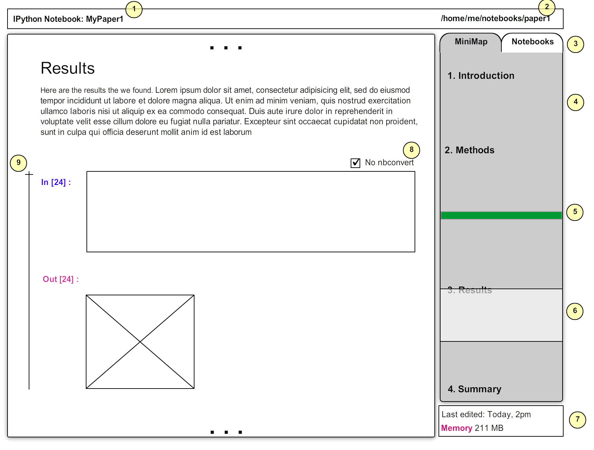

IPython Concept
===============

1. Notebook title.
2. Notebook file path.
3. A fixed-height sidebar consists of two tabs: 

   - MiniMap tab: similar to Sublime Text minimap, showing the structure
     of the document using Heading cells.

   - Notebooks tab: a tree-view of the notebooks in the current directory
     (including subdirectories). Clicking on each notebook either opens it
     in a new tab or goes to its tab if it is already open.

4. MiniMap area - working as a TOC. Clicking on any part of the MiniMap
   will make the notebook to navigate to that section.

5. Green horizental line showing the location of the last executed cell. 
   
6. Current view. The light gray box shows the location of the current view
   in the notebook.

7. General info, like last edit and memory usage by this notebook.

8. *No nbconvert* checkbox prevents nbconvert to include this cell in the latex
   files. Useful when converting to latex for preventing of inclusion of large
   pure-code sections.

9. Collapse this cell and the output.

